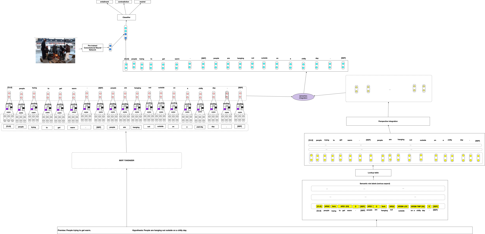

# Visually Grounded Textual Entailment using [SemBERT](https://github.com/cooelf/SemBERT) (Semantics-aware BERT for Language Understanding )
This project investigates whether simply appending visual information to a semantically
rich embedding such as SemBERT can improve Natural Language Inference (NLI) systems built using SemBERT.
 Additionally, it tests such systems' robustness to simple adversarial attacks such as simple lexical inference and simple compositional semantic attacks.

